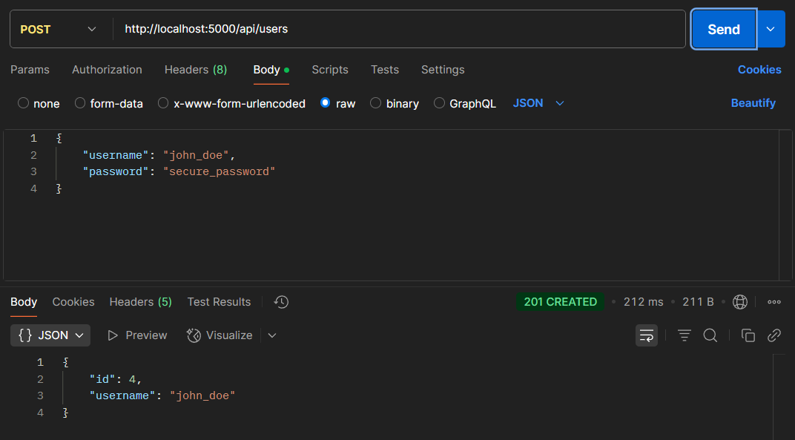
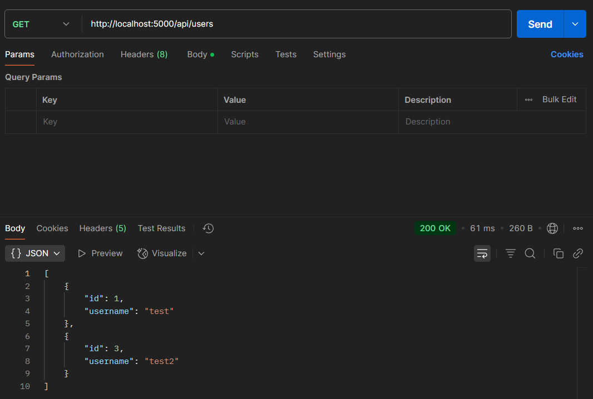
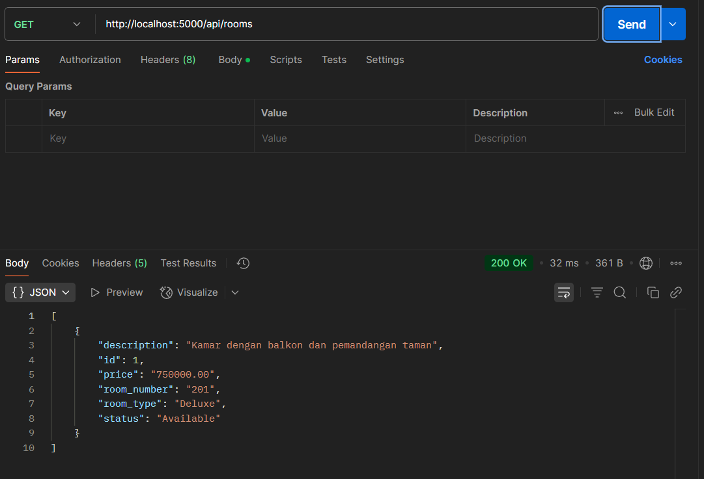
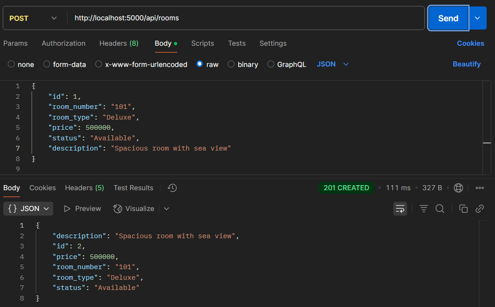
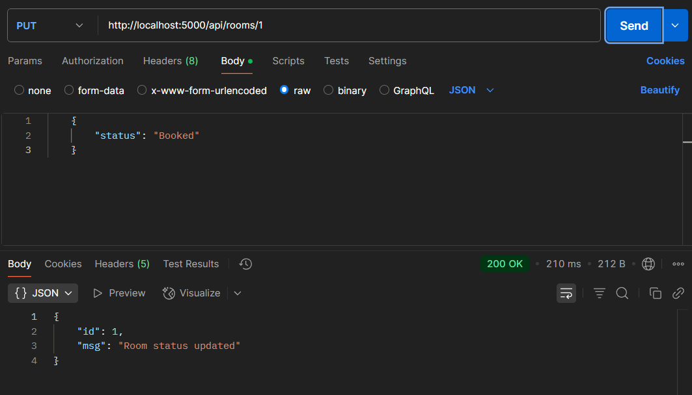

# Laporan Week 10 🗓️

## Anggota 👥
| Nama                    | NIM       | 
| ----------------------- | --------- | 
| **Cahya Galur Permana** | 10221057  |
| **Sheva Aryo Susanto**  | 10221088  |
| **Rifki Anashirul**     | 10221044  | 

## Gambaran Umum 🌐

API Sistem Manajemen Hotel adalah layanan RESTful berbasis Flask yang dirancang untuk mengelola pemesanan kamar hotel dan akun pengguna. Dokumentasi ini memberikan gambaran tentang arsitektur sistem, komponen, dan endpoint API.


## Komponen Utama 🧩

### Aplikasi Utama (app.py) 🚀

Aplikasi utama menginisialisasi server Flask, mendaftarkan blueprint untuk rute modular, dan menyediakan fungsi pemeriksaan koneksi.

```python
from flask import Flask, jsonify
from services.users import user_bp
from services.rooms import room_bp
from services.conn import get_db_connection
import os

app = Flask(__name__)

# Mendaftarkan rute blueprint
app.register_blueprint(user_bp, url_prefix='/api/users')
app.register_blueprint(room_bp, url_prefix='/api/rooms')

# Endpoint root
@app.route('/')
def home():
    return {"message": "Hello from Flask!"}

# Endpoint pemeriksaan kesehatan
@app.route('/health', methods=['GET'])
def health_check():
    try:
        conn = get_db_connection()
        cursor = conn.cursor()
        cursor.execute('SELECT 1')
        result = cursor.fetchone()
        cursor.close()
        conn.close()
        return jsonify({'status': 'healthy'}), 200
    except Exception as e:
        return jsonify({'status': 'unhealthy', 'error': str(e)}), 500

# Menjalankan aplikasi
if __name__ == '__main__':
    app.run(debug=True, host='0.0.0.0', port=5000)
```

### Koneksi Database (conn.py) 🔌

Mengelola koneksi database PostgreSQL dengan logika percobaan ulang untuk ketahanan:

```python
import psycopg2
import os
import time

def get_db_connection():
    conn = None
    max_retries = 5  # Coba maksimal 5 kali
    retries = 0
    
    while conn is None and retries < max_retries:
        try:
            conn = psycopg2.connect(
                host=os.environ.get("DB_HOST", "localhost"),
                database=os.environ.get("DB_NAME", "hotel_cc"),
                user=os.environ.get("DB_USER", "hotel_cc"),
                password=os.environ.get("DB_PASSWORD", "password")
            )
        except psycopg2.OperationalError as e:
            retries += 1
            if retries >= max_retries:
                raise  # Lempar kembali exception setelah percobaan maksimal
            print(f"Koneksi database gagal ({retries}/{max_retries}), mencoba lagi dalam 5 detik...")
            time.sleep(5) 
    return conn
```

### Model Data (models.py) 📊

Model ORM SQLAlchemy untuk entitas sistem:

```python
from flask_sqlalchemy import SQLAlchemy  

db = SQLAlchemy()  

# User: bisa jadi pelanggan atau admin 
class User(db.Model):     
    id = db.Column(db.Integer, primary_key=True)     
    username = db.Column(db.String(100), unique=True, nullable=False)     
    password = db.Column(db.String(255), nullable=False)  

# Model Kamar Hotel 
class Room(db.Model):     
    id = db.Column(db.Integer, primary_key=True)     
    room_number = db.Column(db.String(10), unique=True, nullable=False)     
    room_type = db.Column(db.String(50), nullable=False)     
    price = db.Column(db.Float, nullable=False)     
    status = db.Column(db.String(50), default='Available')  # Available, Booked, Maintenance, dll    
    description = db.Column(db.Text)   
```

### Endpoint API 🔄

#### Manajemen Pengguna (users.py) 👤

Endpoint API untuk pendaftaran dan pengambilan data pengguna:

```python
user_bp = Blueprint('users', __name__)

# Endpoint untuk membuat pengguna baru
@user_bp.route('/', methods=['POST'])
def create_user():
    try:
        data = request.json
        if not data or 'username' not in data or 'password' not in data:
            return jsonify({"error": "Username dan password diperlukan"}), 400
            
        username = data['username']
        password = generate_password_hash(data['password'])  # Hash password untuk keamanan
        
        conn = get_db_connection()
        cur = conn.cursor()
        cur.execute("INSERT INTO users (username, password) VALUES (%s, %s) RETURNING id;", 
                   (username, password))
        new_id = cur.fetchone()[0]
        conn.commit()
        cur.close()
        conn.close()
        
        return jsonify({"id": new_id, "username": username}), 201  # Tidak mengembalikan password dalam respons
    except Exception as e:
        return jsonify({"error": str(e)}), 500

# Endpoint untuk mendapatkan semua pengguna
@user_bp.route('/', methods=['GET'])
def get_users():
    try:
        conn = get_db_connection()
        cur = conn.cursor()
        cur.execute("SELECT id, username FROM users;")  # Tidak mengembalikan password dalam respons
        rows = cur.fetchall()
        cur.close()
        conn.close()
        
        users = [
            {"id": row[0], "username": row[1]} for row in rows
        ]
        return jsonify(users)
    except Exception as e:
        return jsonify({"error": str(e)}), 500
```


## Endpoint API Manajemen Pengguna (users.py) 👤

### 1. POST /api/users/ ✏️
- **Fungsi**: Membuat pengguna baru
- **Metode HTTP**: POST
- **Data yang Diterima**: 
  - username (string): Nama pengguna yang unik
  - password (string): Kata sandi pengguna (akan di-hash untuk keamanan)
- **Proses**:
  - Menerima data JSON yang berisi username dan password
  - Mengamankan password dengan hashing
  - Menyimpan data ke database
  - Mendapatkan ID pengguna baru
- **Response**:
  - Status 201 (Created) jika berhasil
  - JSON berisi id dan username (tanpa password)
  - Status 400 jika data tidak lengkap
  - Status 500 jika terjadi kesalahan server

### 2. GET /api/users/ 📋
- **Fungsi**: Mengambil semua data pengguna
- **Metode HTTP**: GET
- **Data yang Diterima**: Tidak ada
- **Proses**:
  - Mengambil semua data pengguna dari database
  - Hanya mengambil id dan username (tanpa password) untuk keamanan
- **Response**:
  - Status 200 (OK)
  - Array JSON berisi daftar pengguna dengan id dan username
  - Status 500 jika terjadi kesalahan server


## Endpoint Tambahan 🔍

### 1. GET / 🏠
- **Fungsi**: Endpoint root aplikasi
- **Metode HTTP**: GET
- **Response**: 
  - JSON sederhana dengan pesan "Hello from Flask!"

### 2. GET /health ❤️
- **Fungsi**: Pemeriksaan kesehatan koneksi database
- **Metode HTTP**: GET
- **Proses**:
  - Menguji koneksi ke database dengan query sederhana
- **Response**:
  - Status 200 dengan JSON {"status": "healthy"} jika koneksi berhasil
  - Status 500 dengan JSON {"status": "unhealthy", "error": [pesan error]} jika koneksi gagal


#### Manajemen Kamar (rooms.py) 🛏️

Endpoint API untuk pengelolaan kamar hotel:

```python
room_bp = Blueprint('rooms', __name__)

# Endpoint untuk mengambil semua data kamar
@room_bp.route('/', methods=['GET'])
def get_rooms():
    conn = get_db_connection()
    cur = conn.cursor()
    cur.execute("SELECT id, room_number, room_type, price, status, description FROM rooms;")
    rows = cur.fetchall()
    cur.close()
    conn.close()

    rooms = [
        {
            "id": row[0],
            "room_number": row[1],
            "room_type": row[2],
            "price": row[3],
            "status": row[4],
            "description": row[5]
        }
        for row in rows
    ]
    return jsonify(rooms)

# Endpoint untuk menambahkan kamar baru
@room_bp.route('/', methods=['POST'])
def create_room():
    data = request.json
    room_number = data['room_number']
    room_type = data['room_type']
    price = data['price']
    status = data.get('status', 'Available')  # status default
    description = data.get('description', '')

    conn = get_db_connection()
    cur = conn.cursor()
    cur.execute(
        "INSERT INTO rooms (room_number, room_type, price, status, description) "
        "VALUES (%s, %s, %s, %s, %s) RETURNING id;",
        (room_number, room_type, price, status, description)
    )
    new_id = cur.fetchone()[0]
    conn.commit()
    cur.close()
    conn.close()

    return jsonify({
        "id": new_id,
        "room_number": room_number,
        "room_type": room_type,
        "price": price,
        "status": status,
        "description": description
    }), 201

# Endpoint untuk mengubah status kamar
@room_bp.route('/<int:room_id>', methods=['PUT'])
def update_room_status(room_id):
    data = request.json
    status = data['status']

    conn = get_db_connection()
    cur = conn.cursor()
    cur.execute("UPDATE rooms SET status = %s WHERE id = %s RETURNING id;", (status, room_id))
    updated_id = cur.fetchone()[0]
    conn.commit()
    cur.close()
    conn.close()

    return jsonify({"msg": "Status kamar diperbarui", "id": updated_id}), 200
```
## Endpoint API Manajemen Kamar (rooms.py) 🛏️

### 1. GET /api/rooms/ 📋
- **Fungsi**: Mengambil semua data kamar
- **Metode HTTP**: GET
- **Data yang Diterima**: Tidak ada
- **Proses**:
  - Mengambil semua data kamar dari database
  - Menyertakan informasi lengkap setiap kamar
- **Response**:
  - Status 200 (OK)
  - Array JSON berisi daftar kamar dengan detail lengkap
  - Setiap kamar memiliki: id, room_number, room_type, price, status, description

### 2. POST /api/rooms/ ✏️
- **Fungsi**: Menambahkan kamar baru
- **Metode HTTP**: POST
- **Data yang Diterima**:
  - room_number (string): Nomor kamar yang unik
  - room_type (string): Tipe kamar (contoh: Standard, Deluxe, Suite)
  - price (float): Harga kamar
  - status (string, opsional): Status kamar (default: 'Available')
  - description (string, opsional): Deskripsi kamar
- **Proses**:
  - Menerima data JSON kamar baru
  - Menyimpan data ke database
  - Mendapatkan ID kamar baru
- **Response**:
  - Status 201 (Created) jika berhasil
  - JSON berisi semua data kamar termasuk id baru

### 3. PUT /api/rooms/<int:room_id> 🔄
- **Fungsi**: Memperbarui status kamar
- **Metode HTTP**: PUT
- **URL Parameter**: room_id (integer): ID kamar yang akan diperbarui
- **Data yang Diterima**:
  - status (string): Status kamar baru (contoh: 'Available', 'Booked', 'Maintenance')
- **Proses**:
  - Menerima data JSON berisi status baru
  - Memperbarui status kamar di database berdasarkan ID
- **Response**:
  - Status 200 (OK) jika berhasil
  - JSON berisi pesan konfirmasi dan ID kamar yang diperbarui


## Skema Database (schema.sql) 💾

```sql
-- Membuat tabel users
CREATE TABLE IF NOT EXISTS users (
    id SERIAL PRIMARY KEY,
    username VARCHAR(100) UNIQUE NOT NULL,
    password VARCHAR(255) NOT NULL
);

-- Membuat tabel rooms
CREATE TABLE IF NOT EXISTS rooms (
    id SERIAL PRIMARY KEY,
    room_number VARCHAR(10) UNIQUE NOT NULL,
    room_type VARCHAR(50) NOT NULL,
    price FLOAT NOT NULL,
    status VARCHAR(50) DEFAULT 'Available',
    description TEXT
);
```

## Containerization (Dockerfile) 🐳

```dockerfile
# backend/Dockerfile  
FROM python:3.10-slim  

# Membuat direktori kerja di dalam container 
WORKDIR /app  

# Copy file requirements.txt ke dalam container 
COPY requirements.txt requirements.txt  

# Install package yang dibutuhkan dengan pip 
RUN pip install --no-cache-dir -r requirements.txt  

# Copy semua file di direktori saat ini ke dalam container 
COPY . .  

# Membuka port 5000 untuk akses dari luar 
EXPOSE 5000 

# Menjalankan aplikasi dengan perintah python app.py 
CMD ["python", "-m", "services.app"]  
```

## Endpoint API 📡

### Ringkasan Endpoint

| Metode | Endpoint | Deskripsi |
|--------|----------|-----------|
| GET | /api/users/ | Mengambil semua data pengguna |
| POST | /api/users/ | Membuat pengguna baru |
| GET | /api/rooms/ | Mengambil semua data kamar |
| POST | /api/rooms/ | Menambahkan kamar baru |
| PUT | /api/rooms/:id | Memperbarui status kamar |
| GET | /health | Memeriksa kesehatan koneksi database |

## Pengujian API 🧪
Pengujian endpoint API menggunakan API

### Membuat Pengguna Baru ➕👤

```bash
    {
        "username": "john_doe",
        "password": "secure_password"
    }
```

### Mengambil semua data pengguna 📋👥


### Mengambil Daftar Kamar 📋🛏️



### Menambahkan Kamar Baru ➕🛏️

```bash
        {
            "id": 1,
            "room_number": "101",
            "room_type": "Deluxe",
            "price": 500000,
            "status": "Available",
            "description": "Spacious room with sea view"
        }
```


### Mengubah Status Kamar 🔄🛏️

```bash
    {
        "status": "Booked"
    }
```
