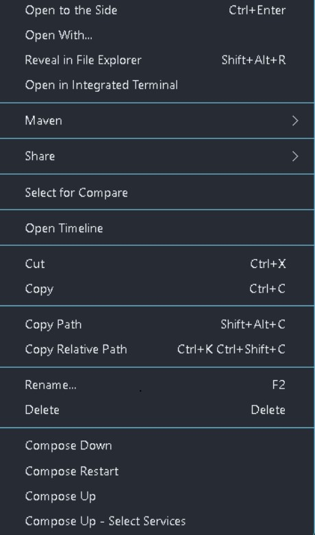
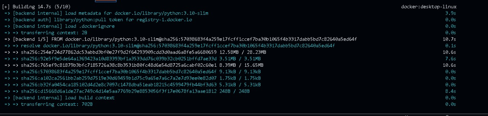
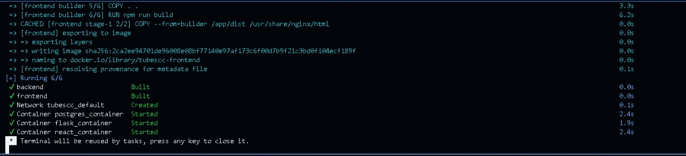
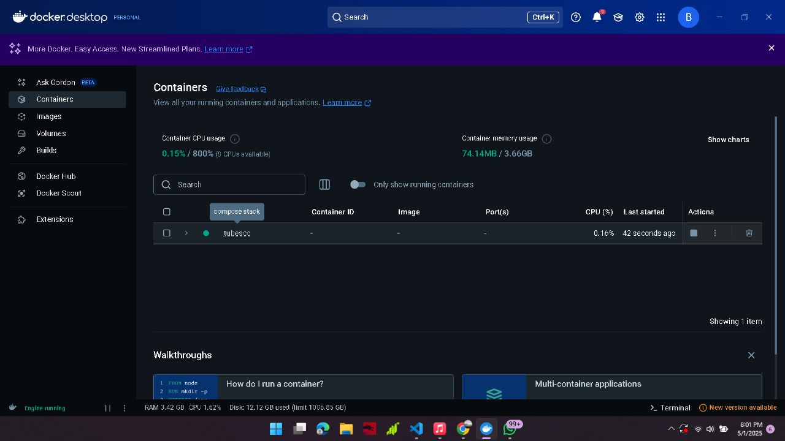
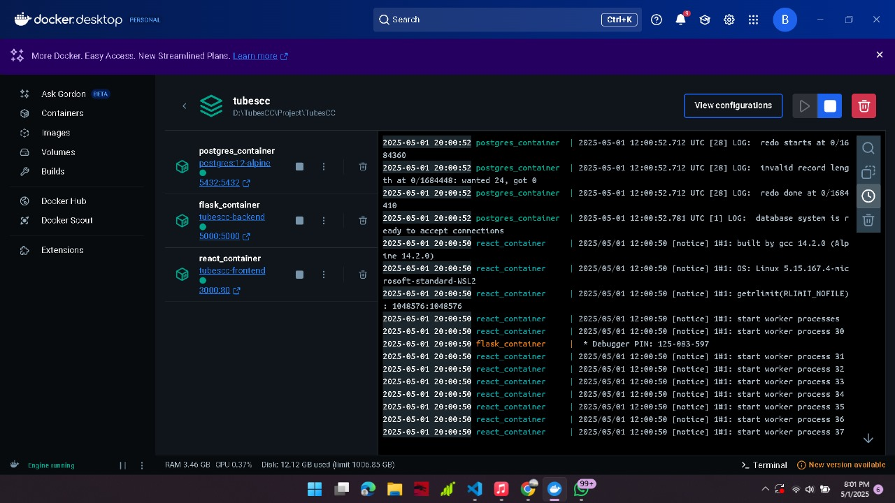
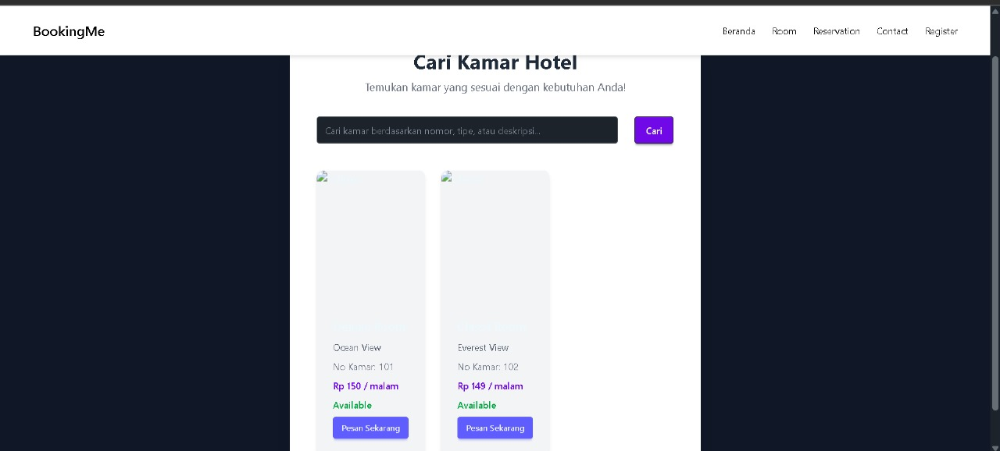
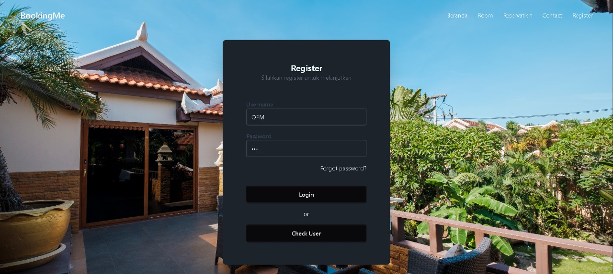

# Laporan Week 11 🗓️

## Anggota 👥
| Nama                    | NIM       | 
| ----------------------- | --------- | 
| **Cahya Galur Permana** | 10221057  |
| **Sheva Aryo Susanto**  | 10221088  |
| **Rifki Anashirul**     | 10221044  | 

### **Penjelasan Konfigurasi `docker-compose.yml`**

Berikut adalah konfigurasi `docker-compose.yml` yang digunakan untuk membangun dan menjalankan layanan-layanan dalam sistem, termasuk backend (API Flask), frontend (aplikasi React), dan database (PostgreSQL).


```yaml
version: '3.10'

services:
  # Layanan Backend (Flask API)
  backend:
    build:
      context: ./backend
    container_name: flask_container
    ports:
      - "5000:5000"  # Mengatur port dari container 5000 ke port 5000 host
    depends_on:
      - db  # Menunggu hingga layanan database siap
    environment:
      - DB_HOST=db  # Nama host dari container database
      - DB_NAME=hotel_cc  # Nama database
      - DB_USER=hotel_cc  # Pengguna database
      - DB_PASSWORD=password  # Password pengguna database

  # Layanan Frontend (React Application)
  frontend:
    build:
      context: ./frontend/main
    container_name: react_container
    ports:
      - "3000:80"  # Mengatur port dari container 80 ke port 3000 host
    depends_on:
      - backend  # Menunggu backend untuk siap sebelum memulai frontend

  # Layanan Database (PostgreSQL)
  db:
    image: postgres:12-alpine  # Menggunakan image PostgreSQL versi 12-alpine
    container_name: postgres_container
    environment:
      - POSTGRES_DB=hotel_cc  # Nama database yang akan dibuat
      - POSTGRES_USER=hotel_cc  # Pengguna database
      - POSTGRES_PASSWORD=password  # Password untuk pengguna database
    ports:
      - "5432:5432"  # Mengatur port dari container 5432 ke port 5432 host
    volumes:
      - db_data:/var/lib/postgresql/data  # Volume untuk data database
      - ./init.sql:/docker-entrypoint-initdb.d/init.sql  # Inisialisasi database menggunakan file init.sql

# Volume untuk menyimpan data database secara persisten
volumes:
  db_data:
```
# Deskripsi Konfigurasi:
## 1. Backend Service (Flask API)
Backend ini menggunakan Flask untuk API yang berkomunikasi dengan frontend dan database.

depends_on: Menjamin bahwa layanan database siap sebelum backend dijalankan.

Variabel lingkungan seperti DB_HOST, DB_NAME, DB_USER, dan DB_PASSWORD digunakan untuk koneksi antara Flask dan PostgreSQL.

## 2. Frontend Service (React Application)
Frontend dibangun dari direktori ./frontend/main dan dipetakan ke port 80 di dalam container, yang akan tersedia pada port 3000 di host.

depends_on: Memastikan frontend dijalankan hanya setelah backend tersedia.

## 3. Database Service (PostgreSQL)
Menggunakan image postgres:12-alpine untuk menjalankan PostgreSQL.

Port 5432 digunakan untuk komunikasi antara aplikasi dan database.

Volume digunakan untuk menyimpan data secara persisten dan juga untuk mengeksekusi skrip inisialisasi database (init.sql) saat pertama kali menjalankan container.

# Proses Build dan Deployment:
Untuk menjalankan layanan-layanan ini, jalankan perintah berikut di terminal:
```
docker-compose up --build

```
Perintah ini akan membangun dan menjalankan semua container yang diperlukan, mulai dari backend, frontend, hingga database.

# Proses Pembuatan dan Build Docker Containers
## 1. 

Proses build dan konfigurasi docker-compose.yml.
## 2. 


Docker mulai membangun image dan menjalankan container.


# Detail Status dan Nama Container
Menampilkan detail status container yang berjalan, termasuk postgres_container, flask_container, dan react_container.



# Web dan Microservices
## 1. Antarmuka pengguna dari aplikasi BookingMe, yang menampilkan halaman profil dan opsi untuk pemesanan kamar hotel.

## 2. Layanan pencarian kamar hotel, menampilkan daftar kamar yang tersedia dengan harga dan detail lainnya.

## 3. Halaman pendaftaran dan autentikasi pengguna, memungkinkan pengguna untuk membuat akun atau login.
