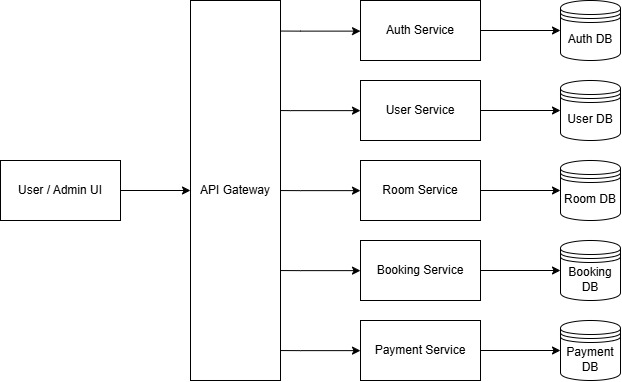

# 🏨 APLIKASI BOOKING HOTEL

&nbsp;

## 👥 Pembagian Tugas

| Nama | NIM |Peran |Deskripsi Tugas |
|------|-----|------|----------------|
| **Cahya Galur Permana** | 10221057   | Backend Developer    | Pengembangan API dengan Flask & PostgreSQL, serta logika sistem booking.   |
| **Sheva Aryo Susanto**  | 102201088  | DevOps Engineer      | Containerisasi (Docker), CI/CD pipeline, deployment, monitoring & infrastruktur. |
| **Rifki Anashirul**     | 10221044   | Frontend Developer   | UI/UX dengan React, integrasi API, dan antarmuka yang responsif dan user-friendly. |

---

## 📌 Deskripsi Proyek

Aplikasi booking hotel berbasis website yang dirancang untuk mengelola proses reservasi kamar secara digital. Pengguna dapat melihat ketersediaan kamar, melakukan reservasi, dan menyelesaikan pembayaran. Sistem ini dibangun menggunakan:

- **Flask** (Backend)
- **PostgreSQL** (Database)
- **React** (Frontend)
- **Docker** (Containerization)

---

## 🎯 Tujuan Proyek

- Menyediakan platform booking hotel yang efisien dan ramah pengguna.
- Mengotomatisasi proses reservasi untuk meningkatkan produktivitas operasional.
- Mempermudah manajemen hotel dalam pelacakan dan pengaturan reservasi serta ketersediaan kamar.

---

## 🧭 Scope Proyek

- Pengembangan backend menggunakan Flask & PostgreSQL
- Pengembangan frontend menggunakan React
- Implementasi fitur autentikasi
- Sistem manajemen booking dan kamar
- Sistem pembayaran
- Containerization menggunakan Docker
- API documentation dalam format Markdown

---

## 📅 Timeline dan Deliverable Proyek

| Pekan | Fokus Utama                      | Tugas                                                                 | Deliverable                                                                                             |
|-------|----------------------------------|------------------------------------------------------------------------|----------------------------------------------------------------------------------------------------------|
| 9     | 🛠️ Perancangan Proyek             | Memilih tema, arsitektur microservices, wireframe, setup GitHub       | Proposal proyek (Markdown), diagram arsitektur, wireframe, struktur repo awal + README.md              |
| 10    | ⚙️ Pengembangan Backend           | 2 layanan Flask, API, database schema, Docker backend            | Kode backend, dokumentasi API, file SQL, Dockerfile, screenshot proses + penjelasan                     |
| 11    | 💻 Pengembangan Frontend         | UI React+Vite, integrasi API, Docker frontend                         | Kode frontend, Dockerfile frontend, screenshot UI + penjelasan fitur & komponen                         |
| 12    | 🔗 Integrasi & Docker Compose    | Integrasi layanan, komunikasi antar service, volume persistence       | File Docker Compose, dokumentasi integrasi, screenshot proses + penjelasan                              |
| 13    | 🚀 CI/CD & Cloud Deployment      | GitHub Actions, deployment cloud, konfigurasi secrets/env             | File workflow GitHub Actions, dokumentasi deployment, screenshot proses, Live URL                      |
| 14    | 📈 Monitoring, Logging, Scaling  | Monitoring (Prometheus/cloud), logging terpusat, auto/manual scaling  | Konfigurasi monitoring & logging, screenshot dashboard + analisis scaling performance                   |
| 15    | 🎓 Finalisasi & Presentasi       | Perbaikan bug, dokumentasi lengkap, security review, presentasi       | Dokumentasi final proyek (Markdown), presentasi (Markdown/PDF), laporan keamanan, screenshot aplikasi  |

---

## 🖼️ Frontend Wireframe

_(Tambahkan gambar wireframe di sini, atau tautan ke file wireframe jika eksternal)_

---

## 🧩 Microservice Architecture

### Komponen Arsitektur Microservice

1. **User / Admin UI**  
   Antar muka untuk pengguna dan admin hotel.
2. **API Gateway**  
   Pusat masuk semua request: routing ke service, autentikasi.
3. **Auth Service**  
   Login/registrasi, token JWT, otorisasi user & admin.
4. **User Service**  
   Profil pengguna, riwayat menginap.
5. **Room Service**  
   Daftar kamar, ketersediaan, fasilitas, harga, foto.
6. **Booking Service**  
   Reservasi, manajemen booking, check-in/out, pembatalan.
7. **Payment Service**  
   Proses pembayaran, invoice & kwitansi.
8. **Database**  
   Database PostgreSQL untuk seluruh data sistem.

---
